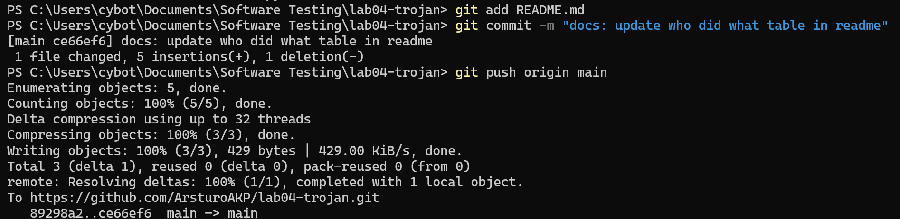
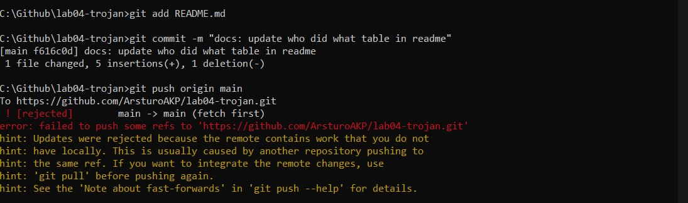
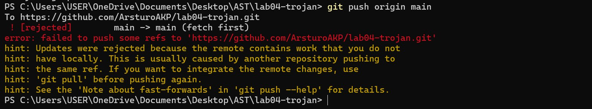

# lab04-trojan
**Course:** 192-211 Automated Software Testing
**Repository:** lab04-trojan
**Members:** Aung Kyaw Phyo (Leader), L Peter San Awng, Thin Thiri Zaw

## 2. Who Did What
| Member | ID | Role | Assigned File |
|---|---|---|---|
| L Peter San Awng | 6705142021 | Collaborator |  test_withdraw.py |
| Aung Kyaw Phyo | 6705142012 | Leader | test_deposit.py, test_shared.pt & conftest.py |
| Thin Thiri Zaw | 6705142020 | Collaborator | test_teardown.py |

## 3. Our Merge Conflict

### What happened

All three of us edited the "Who Did What" table in README.md at the same time.
Each person added only their own row and made a commit on their own laptop.
Then we all tried to push to GitHub.

1. **Aung Kyaw Phyo pushed first** (commit `ce66ef6`). His push was successful
   because nobody else had pushed yet.

   

2. **L Peter San Awng pushed next** (commit `f616c0d`). GitHub rejected his push
   with `! [rejected] main -> main (fetch first)`. This happened because GitHub
   now had Aung's commit, but Peter's laptop did not have it yet. Git refuses the
   push so that Peter cannot accidentally overwrite Aung's work.

   

3. **Peter ran `git pull origin main`** to download Aung's commit. Git tried to
   combine the two versions of README.md, but it could not, and reported:
   `CONFLICT (content): Merge conflict in README.md`

### The conflict markers we saw

Git wrote these markers into Peter's README.md:

```
<<<<<<< HEAD
| L Peter San Awng | 6705142021 | Collaborator |  test_withdraw.py |
=======
| Aung Kyaw Phyo | 6705142012 | Leader | test_deposit.py, test_shared.pt & conftest.py |
>>>>>>> ce66ef6
```

- `<<<<<<< HEAD` to `=======` is **Peter's version** (his local commit).
- `=======` to `>>>>>>> ce66ef6` is **Aung's version**, which came from GitHub.
  `ce66ef6` is the ID of Aung's commit.
- Until these markers are removed, the file is not finished and Git will not
  let the merge complete.

### Our final decision

We decided to **keep both rows**, because each row belongs to a different member
and both are correct. Choosing only one row would have deleted a teammate's
information. Peter deleted only the three marker lines (`<<<<<<<`, `=======`,
`>>>>>>>`), kept both rows, and then ran:

```
git add README.md
git commit -m "fix: resolve README merge conflict by adding my contribution"
git push origin main
```

This created the merge commit `eb3c636`, which joins Aung's work and Peter's
work together. You can see it in the history with `git log --oneline --graph`.

4. **Thin Thiri Zaw pushed last.** Her push was also rejected, for the same
   reason: GitHub had new commits (Aung's and Peter's) that her laptop did not
   have yet.

   

   She ran `git pull origin main` to download the fixed version with both rows,
   added her own row below them, and pushed again. The final table has all three
   members:

   | Member | Role | Assigned File |
   |---|---|---|
   | Aung Kyaw Phyo | Leader | test_deposit.py, test_shared.py & conftest.py |
   | L Peter San Awng | Collaborator | test_withdraw.py |
   | Thin Thiri Zaw | Collaborator | test_teardown.py |

### Why Git could not fix it automatically

Git can combine two people's changes automatically when they change **different
lines** of a file. In our case, Aung and Peter both started from the same version
of README.md, and both added a new line in the **same place**, directly under the
table header. Git only compares text; it does not understand what the lines mean.
It cannot know whether we want Aung's row, Peter's row, or both, or in which
order. If Git guessed wrong, it could silently delete someone's work, so it stops
and asks a person to decide.